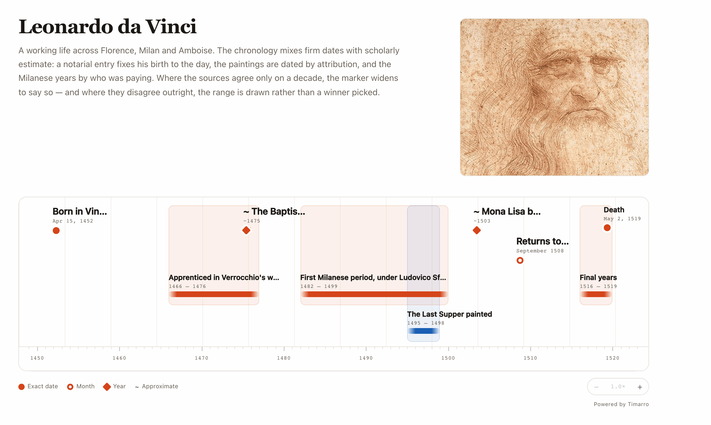

# timarro

[](https://www.npmjs.com/package/timarro)
[](https://www.npmjs.com/package/timarro)
[](./LICENSE)

Framework-agnostic web component for historical timelines: **`<timarro-timeline>`**.

Drop in JSON. Get a keyboard-accessible, precision-aware timeline that works in any stack — plain HTML, Next.js, Vue, a CMS embed.



The open rendering layer of [timarro.com](https://timarro.com) — create, share, and embed visual timelines. Rendered timelines carry a small “Powered by Timarro” attribution.

---

## Why Timarro

- **Data in, timeline out** — consumes a JSON document of events. Where the data comes from is not the engine’s business.
- **Fuzzy dates are first-class** — year, month, day, and datetime precision render as distinct markers (dots, rings, diamonds), with uncertainty bands, gradient-faded range endpoints, and optional `circa`.
- **Zero runtime deps in the embed** — vanilla TypeScript [custom element](https://developer.mozilla.org/en-US/docs/Web/API/Web_components); ≤ 25 kB minified. An optional Zod schema ships on a separate subpath.
- **Responsive by container** — horizontal lanes when wide; a vertical rail under 800px of _container_ width (not viewport). Or pin either mode.
- **Accessible** — arrow / Home / End across events, Enter opens details, Esc closes; ARIA throughout; `prefers-reduced-motion` respected.

---

## Install

```bash
npm install timarro
# or: pnpm add timarro · yarn add timarro · bun add timarro
```

### Bundler

```ts
import { define } from 'timarro';

define(); // registers <timarro-timeline>
```

```html
<timarro-timeline src="/data/apollo.json"></timarro-timeline>
```

Or import the side-effect entry:

```ts
import 'timarro/register';
```

### CDN (self-registering)

```html
<script src="https://unpkg.com/timarro"></script>
<timarro-timeline src="/data/apollo.json"></timarro-timeline>
```

Also available on [jsDelivr](https://www.jsdelivr.com/package/npm/timarro). The IIFE exposes `window.Timarro`.

### Programmatic data

```ts
const el = document.querySelector('timarro-timeline');
el.data = {
  timeline: { id: 'tl-apollo', title: 'Apollo program' },
  events: [
    {
      id: 'ev-first-step',
      title: 'First step on the Moon',
      date: { start: '1969-07-21T02:56:15Z', precision: 'datetime' },
    },
  ],
};
```

Setting `data` aborts any in-flight `src` fetch — the property wins.

### Next.js

Custom elements don’t SSR. Define client-side:

```tsx
'use client';

import { useEffect } from 'react';

export default function Timeline() {
  useEffect(() => {
    void import('timarro').then((m) => m.define());
  }, []);

  return <timarro-timeline src="/fixtures/apollo.json" />;
}
```

---

## API

### Attributes

| Attribute     | Values                               | Default        | Notes                                                     |
| ------------- | ------------------------------------ | -------------- | --------------------------------------------------------- |
| `src`         | URL of a timeline JSON document      | —              | fetched with abort-on-change; the `data` property wins    |
| `locale`      | BCP-47 tag (`en`, `cs`, `de-AT`, …)  | browser locale | all dates format via `Intl` in UTC                        |
| `orientation` | `auto` \| `horizontal` \| `vertical` | `auto`         | `auto` switches to vertical when the container is < 800px |
| `legend`      | `false` / `off` to hide              | shown          | compact key for the precision marker shapes               |

### Properties

| Property | Type                          | Notes                                                     |
| -------- | ----------------------------- | --------------------------------------------------------- |
| `data`   | `TimarroTimelineData \| null` | set to render; reads back the last _valid_ data or `null` |

### Events

All bubble and are composed (`shadowRoot` → light DOM).

| Event            | `detail`                | Fires when                                   |
| ---------------- | ----------------------- | -------------------------------------------- |
| `timarro:load`   | `{ timeline }`          | data validated and rendered                  |
| `timarro:error`  | `{ message[, issues] }` | fetch failed or validation rejected the data |
| `timarro:select` | `{ event }`             | an event marker is activated                 |

```ts
el.addEventListener('timarro:select', (e) => {
  console.log(e.detail.event.title);
});
```

### Theming

CSS custom properties on the host:

| Token                    | Role                        |
| ------------------------ | --------------------------- |
| `--timarro-accent`       | markers, ranges, brand link |
| `--timarro-bg`           | host background             |
| `--timarro-fg`           | primary text                |
| `--timarro-muted`        | secondary text              |
| `--timarro-border`       | rules and dividers          |
| `--timarro-font`         | UI / body                   |
| `--timarro-display-font` | title                       |
| `--timarro-mono-font`    | dates and tick labels       |
| `--timarro-error`        | validation / load errors    |
| `--timarro-card-bg`      | event detail card           |
| `--timarro-card-fg`      | event detail card text      |

Shadow parts for deeper styling:
`::part(header | viewport | event | axis | card | legend | brand)`.

```css
timarro-timeline {
  --timarro-accent: #d6451b;
  --timarro-display-font: 'Fraunces', Georgia, serif;
  --timarro-font: 'IBM Plex Sans', system-ui, sans-serif;
  --timarro-mono-font: 'IBM Plex Mono', ui-monospace, monospace;
}
```

Per-event accents: set `color` on an event (any CSS color). It overrides `--timarro-accent` for that event’s marker, range, and uncertainty band.

---

## Data format (v1)

Shape: `{ timeline, events }`. Full types live in `timarro`; the canonical Zod schema is `timarro/schema`.

```json
{
  "timeline": {
    "id": "tl-apollo",
    "title": "Apollo program",
    "description": "Key milestones of NASA's Apollo program, 1961–1972."
  },
  "events": [
    {
      "id": "ev-apollo-11-launch",
      "title": "Apollo 11 launches from Kennedy Space Center",
      "date": { "start": "1969-07-16T13:32:00Z", "precision": "datetime" },
      "entities": ["Neil Armstrong", "Buzz Aldrin", "Michael Collins"]
    },
    {
      "id": "ev-apollo-8",
      "title": "Apollo 8 — first crewed lunar orbit",
      "date": { "start": "1968-12-21", "end": "1968-12-27", "precision": "day" }
    }
  ]
}
```

### Fuzzy dates

| `date.start` / `date.end`              | `date.precision` | Rendered as                |
| -------------------------------------- | ---------------- | -------------------------- |
| `"1943"`                               | `year`           | year-wide uncertainty band |
| `"1943-05"`                            | `month`          | month-wide band            |
| `"1943-05-12"`                         | `day`            | exact marker               |
| `"1943-05-12T14:30[:00][Z or ±HH:MM]"` | `datetime`       | exact marker               |

Rules:

- `precision` must match the granularity of `start` (validation error otherwise).
- `end` is optional and may use a different granularity than `start`.
- Date-only values are UTC calendar dates; naive datetimes are treated as UTC.
- `"circa": true` marks an approximate date (`~1943`) without widening its interval.
- Every value resolves to a half-open interval `[earliest, latest)` — markers sit at the midpoint; uncertainty bands span the interval.
- BCE dates are rejected in v1.

Optional event fields: `description`, `entities`, `mediaUrls` (http/https only), `sourceRef`, `color`, `order`.

### Validation

The element validates on `data` set and surfaces issues in the UI. For programmatic checks:

```ts
import { validateTimelineData } from 'timarro'; // dependency-free; ships in the embed
import { timarroTimelineDataSchema } from 'timarro/schema'; // canonical Zod schema
```

---

## Development

```bash
pnpm install
pnpm demo     # vite dev server with the demo page
pnpm test     # vitest
pnpm build    # tsup → dist/ (ESM + CJS + types + CDN bundle)
pnpm size     # assert ≤ 25 kB CDN bundle
```

Requires Node ≥ 24.

---

## License

[MIT](./LICENSE) · [timarro.com](https://timarro.com) · [npm](https://www.npmjs.com/package/timarro)
